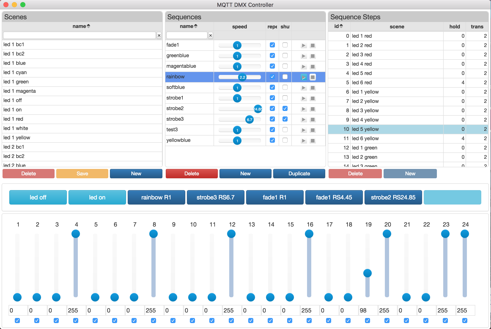

# MQTT DMX Controller

[![License][mit-badge]][mit-url]

> A simple ArtNet / DMX Controller with MQTT Interface

## Install

#### macOS

Go to the [latest release page](https://github.com/hobbyquaker/mqtt-dmx-controller/releases/latest) and download the 
mqtt-dmx-controller-x.x.x.dmg file.

#### Linux

On the [latest release page](https://github.com/hobbyquaker/mqtt-dmx-controller/releases/latest) you can find a .deb 
file for Ubuntu and Debian and a .tar.gz that should work on other distributions.

#### Windows

On the [latest release page](https://github.com/hobbyquaker/mqtt-dmx-controller/releases/latest) you can find 
mqtt-dmx-controller-setup-x.x.x.exe that should work under 64bit Windows.

## Usage

Should be quite self-explanatory when you're experienced with DMX Controllers. If you have questions please open a 
[Issue](https://github.com/hobbyquaker/mqtt-dmx-controller/issues/new).

Beside the normal operation like many other DMX Controllers it's also possible to use MQTT to set channel values, 
activate scenes and control sequences. The topics and payloads used for this are the same as described in the
[mqtt-dmx-sequencer](https://github.com/hobbyquaker/mqtt-dmx-sequencer) documentation.

## Related

* [mqtt-dmx-sequencer](https://github.com/hobbyquaker/mqtt-dmx-sequencer) - the headless counterpart to this 
Software. You can export scene- and sequence-files from mqtt-dmx-controller that can be used with the mqtt-dmx-sequencer 
for fully automated and headless DMX Control.
* [artnet](https://github.com/hobbyquaker/artnet) - [Node.js](http://nodejs.org) module that can be used to send ArtDMX 
packages to an [Art-Net](http://en.wikipedia.org/wiki/Art-Net) node.

## License

The MIT License (MIT)

Copyright (c) Sebastian Raff 

Permission is hereby granted, free of charge, to any person obtaining a copy
of this software and associated documentation files (the "Software"), to deal
in the Software without restriction, including without limitation the rights
to use, copy, modify, merge, publish, distribute, sublicense, and/or sell
copies of the Software, and to permit persons to whom the Software is
furnished to do so, subject to the following conditions:

The above copyright notice and this permission notice shall be included in all
copies or substantial portions of the Software.

THE SOFTWARE IS PROVIDED "AS IS", WITHOUT WARRANTY OF ANY KIND, EXPRESS OR
IMPLIED, INCLUDING BUT NOT LIMITED TO THE WARRANTIES OF MERCHANTABILITY,
FITNESS FOR A PARTICULAR PURPOSE AND NONINFRINGEMENT. IN NO EVENT SHALL THE
AUTHORS OR COPYRIGHT HOLDERS BE LIABLE FOR ANY CLAIM, DAMAGES OR OTHER
LIABILITY, WHETHER IN AN ACTION OF CONTRACT, TORT OR OTHERWISE, ARISING FROM,
OUT OF OR IN CONNECTION WITH THE SOFTWARE OR THE USE OR OTHER DEALINGS IN THE
SOFTWARE.

## Credits

Art-Net™ Designed by and Copyright [Artistic Licence Holdings Ltd](http://www.artisticlicence.com/).

[mit-badge]: https://img.shields.io/badge/License-MIT-blue.svg?style=flat
[mit-url]: LICENSE
